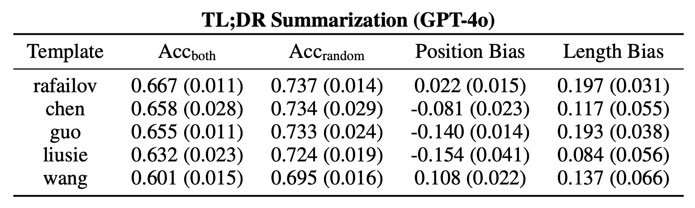
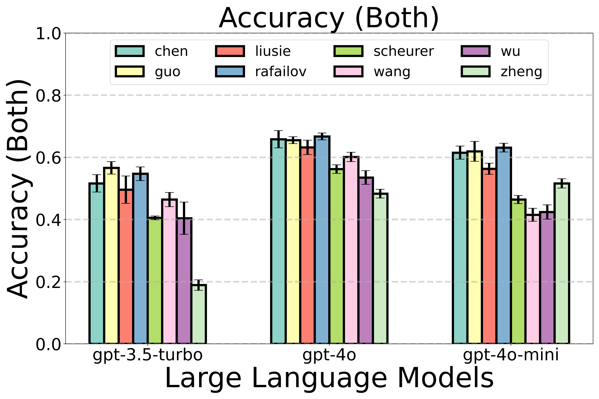
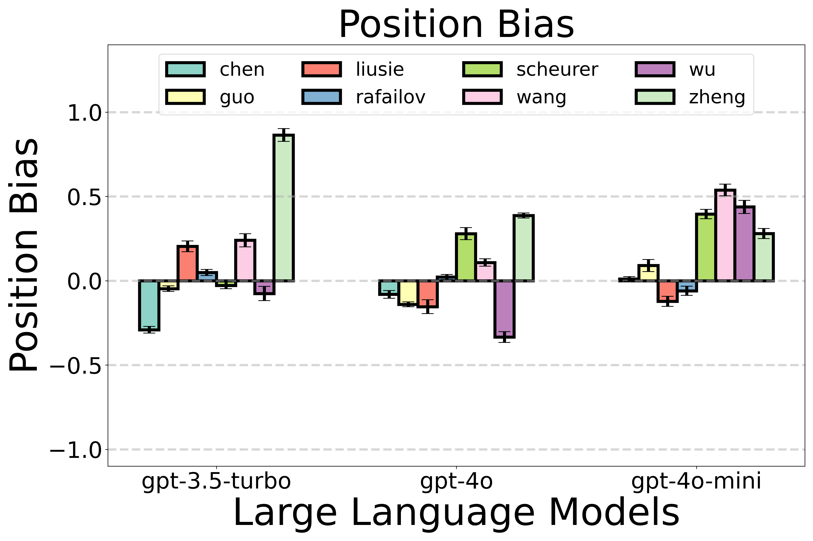
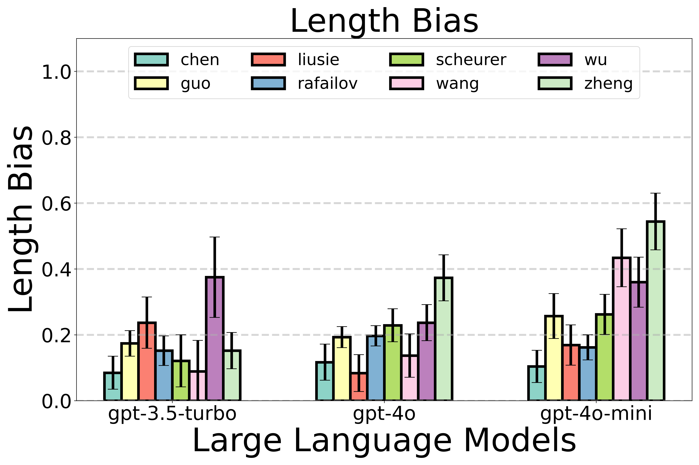
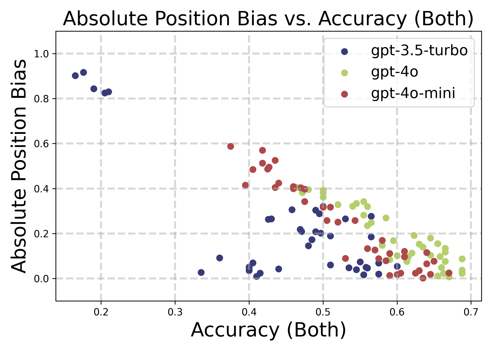

### Systematic Evaluation of LLM-as-a-Judge in LLM Alignment Tasks: Explainable Metrics and Diverse Prompt Templates
* Code coming soon.

Example Evaluation Results
#### Metric Report Tables
Metric report tables related to evaluating LLM judges (``model:GPT-4o`` with different templates) on the ``TL;DR Summarization`` dataset.

  

    
  

#### Visualization Results
Visualization results related to evaluating LLM judges (models + different templates) on the ``TL;DR Summarization`` dataset.\
   
   