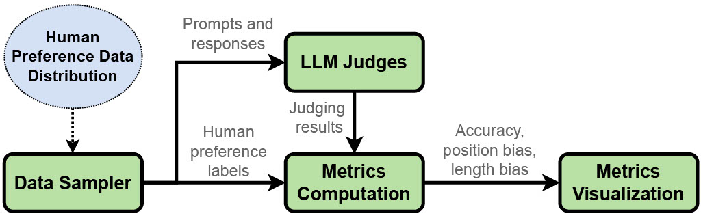
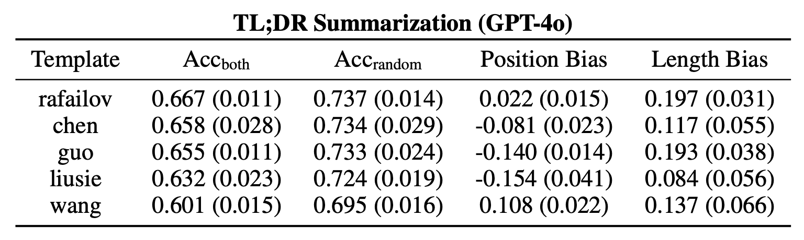
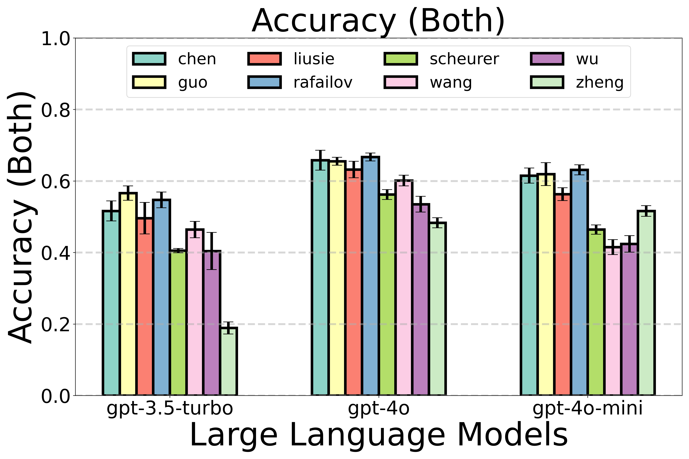
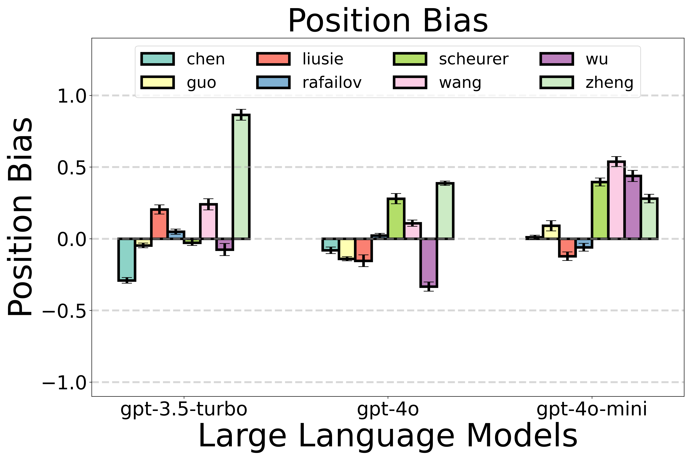
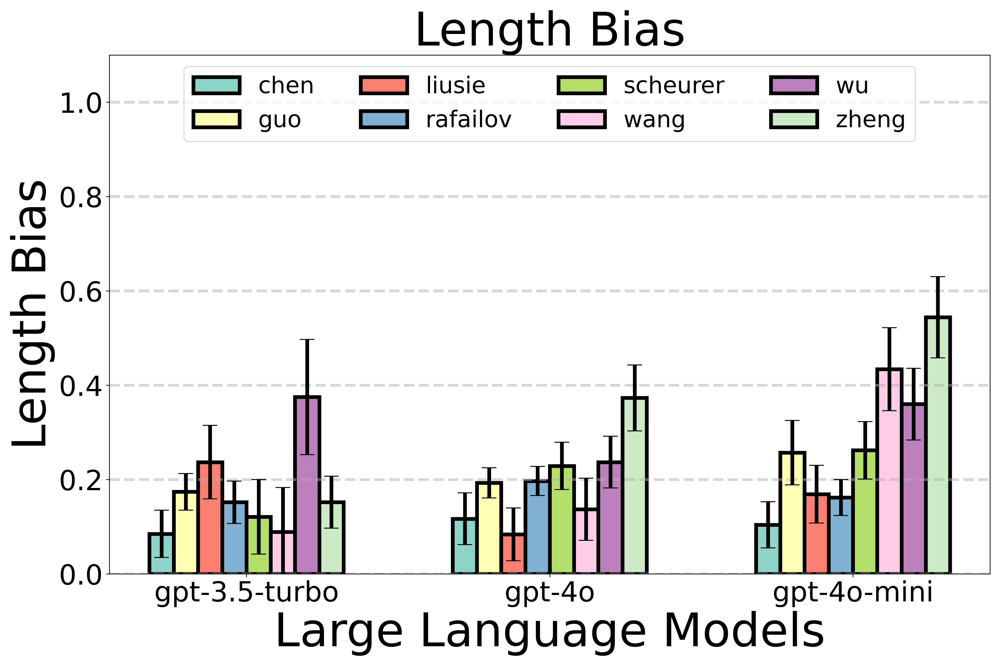
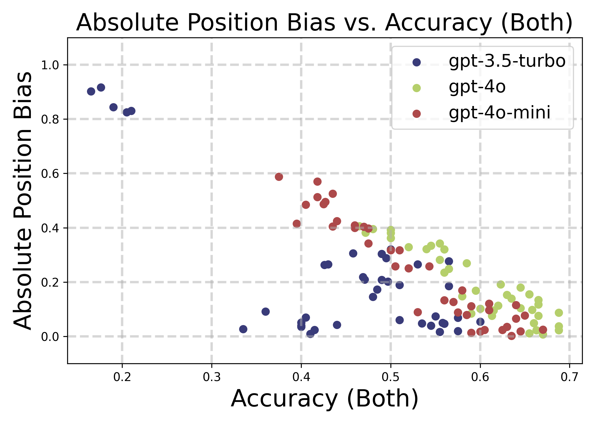

# Systematic Evaluation of LLM-as-a-Judge in LLM Alignment Tasks: Explainable Metrics and Diverse Prompt Templates [ICLR 2025 Workshop]

### Introduction
This repository contains code for our paper _Systematic Evaluation of LLM-as-a-Judge in LLM Alignment Tasks: Explainable Metrics and Diverse Prompt Templates_. [[arXiv](https://arxiv.org/pdf/2408.13006)], which will be presented in [ICLR 2025 Workshop on Building Trust in Language Models and Applications](https://iclr.cc/virtual/2025/workshop/23984).



In this work, we systematically evaluate LLM-as-a-Judge methodology on two LLM alignment datasets (i.e ``TL;DR Summerization`` and ``HH-RLHF-Helpful``):
* we define evaluation metrics with improved theoretical interpretability. 
* we develop a framework to evaluate, compare, and visualize the reliability and alignment of LLM judges.
* we investigate the effect of diverse prompt templates on LLM-judge reliability. 
* our results indicate a significant impact of prompt templates on LLM judge performance, as well as a mediocre alignment level between the tested LLM judges and human evaluators.

### Package installation
Run the following command to install the required Python packages.
```bash
# install uv
pip install uv

# build virtual environment and activate the virtual environment
uv venv --python 3.11
source .venv/bin/activate

# install requirement
uv pip install -r requirements.txt

# export python python
vi ~/.bashrc
export PYTHONPATH=./
```

### 🚀 Quick Evaluation of LLM-as-Judges: Accuracy (Both) and Accuracy (Random)
#### Build up an LLM inference API service using vllm
Here is an example command to set up an LLM inference API service using vllm (See vllm [quickstart](https://docs.vllm.ai/en/latest/getting_started/quickstart.html) for more usage)
```bash
CUDA_VISIBLE_GPUS=0 vllm serve Qwen/Qwen2.5-7B-Instruct --port 8000 --served-model-name qwen2.5_7b_instruct --max-model-len 2024
```
A LLM inference API service compatible with OpenAI API service is then built with attributes: 
* model: qwen2.5_7b_instruct
* base_url: http://localhost:8000/v1

Use the command below to check if the API service is setup successfully or not:
```bash
curl http://localhost:8000/v1/models
curl http://localhost:8000/v1/completions \
    -H "Content-Type: application/json" \
    -d '{
        "model": "qwen2.5_7b_instruct",
        "prompt": "San Francisco is a",
        "max_tokens": 7,
        "temperature": 0
    }'
```
#### Qucik Evaluation of LLM-as-Judges (Open-source LLMs)
```bash
# enter the project directory
cd llm-judge-eval

# summary task
python simple_eval/judge_eval.py --model qwen2.5_7b_instruct --base_url http://localhost:8000/v1 --task summary
# {'acc_both': 0.58, 'valid_count_both': 200, 'acc_random': 0.645, 'valid_count_random': 200}

# hh_rlhf_helpful task    
python simple_eval/judge_eval.py --model qwen2.5_7b_instruct --base_url http://localhost:8000/v1 --task hh_rlhf_helpful
```
#### Qucik Evaluation of LLM-as-Judges (OpenAI models)
```bash
export OPENAI_API_KEY=[YOUR OPENAI API KEY HERE]  # You need to set OPENAI_API_KEY environment variable
cd llm-judge-eval
python simple_eval/judge_eval.py --model gpt-4o-mini --task summary            # summary task
python simple_eval/judge_eval.py --model gpt-4o-mini --task hh_rlhf_helpful    # hh_rlhf_helpful task
python simple_eval/judge_eval.py --model gpt-4o --task summary                 # summary task
python simple_eval/judge_eval.py --model gpt-4o --task summhh_rlhf_helpfulary  # summary task
```

### Full Evaluation of LLM-as-Judges
#### Dataset Preprocessing
Use the following command to prepare a formatted dataset for the LLM judge evaluation process. 
The default dir to save the processed dataset ``./datasets/formatted_datasets``. 
The ``dataset_id`` identifies the formatted dataset, which is better kept consistent in the following steps.

```bash
python datasets/data_preprocessing.py \      
--data-path datasets/raw_datasets/ \         # directory to save downloaded dataset from the original data source
--output-dir datasets/formatted_datasets/ \  # directory to save the processed datasets
--dataset-id summarize                       # summarize, hhrlhf_helpful
```

#### Add OpenAI Key
Add your own OpenAI key to ``configs/openai_api_key.py`` in order to evaluate LLM judges.

#### Evaluate a Set of LLM Judges by Metric Computation and Visualization
Use the example below to evaluate a set of LLM judges using the example dataset ``dataset_id=summarize``.
The templates are specified in ``templates/dataset_id`` folders.

```bash
python eval/eval_llm_judges.py \
--processed_data_path ./datasets/formatted_datasets/summarize/data.summarize.xxxx-xx-xx.jsonl \  # data path to the preprocessed dataset
--dataset_id summarize \  # dataset task (summarize or hhrlhf-helpful)
--split_size 200 \        # number of samples in each split
--num_splits 5 \          # number of splits
--self_consist_id 0 \     # index of split used to compute self-consistency results
--num_runs 5 \            # number of repetition to run the split to compute the self-consistency results                                                                     
--num_eval -1 \           # number of evaluated samples in each split (-1 means all samples in the split)
--models "['gpt-4o-mini']" \  # list of LLM names
--templates "['chen-2023_summarize', 'guo-2024_summarize']" \  # list of templates
--extract_rule combine \  # rule to make binary output from the judging results ("combine", "chosen_reject" or "reject_chosen")
--temperature 0.1 \       # temperature parameter used for LLM inference
--num_workers 8 \         # number of processes to run judging results in parallel
--use_cache_samples \     # if use cached sampling results
--use_cache_results \     # if use cached computation and visualization results
--cache_dir ./outputs/    # directory to store the output results
```

#### Example Evaluation Results
##### Metric Report Tables
Metric report tables related to evaluating LLM judges (``model:GPT-4o`` with different templates) on the ``TL;DR Summarization`` dataset.
<div style="display: grid; grid-template-columns: repeat(1, 1fr); gap: 2px; text-align: center;" >
  <div>
    
  </div>
</div>

##### Visualization Results
Visualization results related to evaluating LLM judges (models + different templates) on the ``TL;DR Summarization`` dataset.\
   
   

### References
```
@article{wei2024systematic,
  title={Systematic Evaluation of LLM-as-a-Judge in LLM Alignment Tasks: Explainable Metrics and Diverse Prompt Templates},
  author={Wei, Hui and He, Shenghua and Xia, Tian and Wong, Andy and Lin, Jingyang and Han, Mei},
  journal={arXiv preprint arXiv:2408.13006},
  year={2024}
}
```